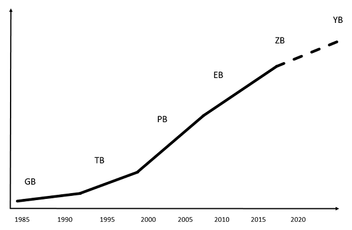
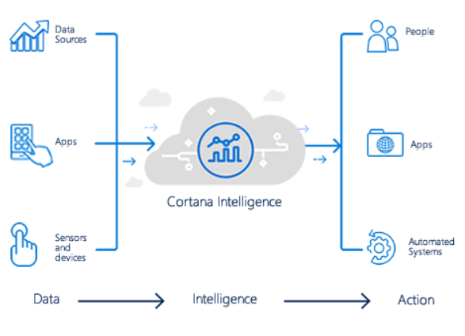
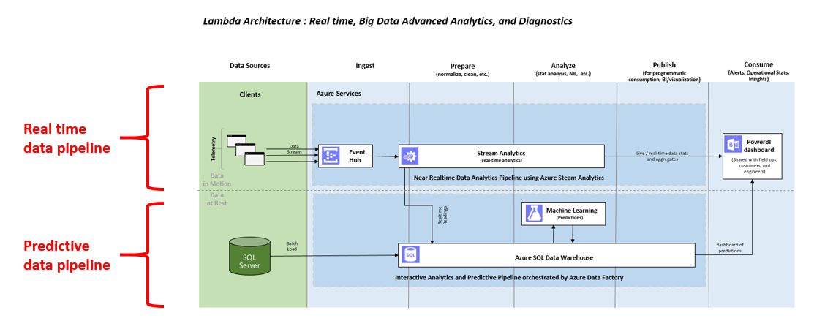

<properties
	pageTitle="Setting up predictive analytics pipelines using Azure SQL Data Warehouse | Microsoft Azure"
	description="Setting up predictive analytics pipelines using Azure SQL Data Warehouse."
	keywords="adf, azure data factory"
	services="sql-data-warehouse,data-factory,event-hubs,machine-learning,service-bus,stream-analytics"
	documentationCenter=""
	authors="roalexan"
	manager="paulettm"
	editor=""/>

<tags
	ms.service="sql-data-warehouse"
	ms.workload="data-services"
	ms.tgt_pltfrm="na"
	ms.devlang="na"
	ms.topic="article"
	ms.date="04/04/2016"
	ms.author="roalexan" />

# Setting up predictive analytics pipelines using Azure SQL Data Warehouse

*This post is by Robert Alexander, Solution Architect at the Machine Learning Team at Microsoft.*

Big data is big and it's getting bigger. Better get used to a whole new set of <a href="https://en.wikipedia.org/wiki/Metric_prefix">prefixes</a> beyond peta such as exa, zetta, and yotta. The amount of data is projected to increase until by 2020 there will be about 50 zettabytes of data - nearly as many bits as there are stars in the universe.

The sheer size of these data presents both immense opportunities and real challenges to businesses. Having access to  mountains of data - from the internet of things, from applications in the cloud, from mobile devices - will enable businesses to transform data into faster and better decisions. The result? more real-time and user-specific actions, lower costs, lower risks, new products and services - even entirely new businesses.

Managing such a vast amount of data is no trivial matter. How to securely and reliably store the data? How to quickly move and collate data across organizational boundaries? How to efficiently analyze the data? How to find the right talent and technologies to handle the quickly evolving technological landscape? How to create the right architecture that fits within the IT budget? These are just some of the questions that must be answered.

Microsoft has been hard at work building services and infrastructure in the big data space. The <a href="https://www.microsoft.com/en-us/server-cloud/cortana-intelligence-suite/what-is-cortana-intelligence.aspx">Cortana Intelligence Suite</a> allows businesses to manage and make use of data at such scale. As a fully managed big data and advanced analytics suite, the Cortana Intelligence Suite is a powerful solution to transform your data into intelligent action.

The Cortana Intelligence Suite consists of a number of services that can be used to create predictive analytics pipelines. <a href="https://azure.microsoft.com/en-us/documentation/articles/sql-data-warehouse-overview-what-is"/>Azure SQL Data Warehouse</a> is a service that provides a cloud-based, scalable database capable of processing massive volumes of data. <a href="https://azure.microsoft.com/en-us/services/machine-learning/">Azure Machine Learning</a> provides a fully managed cloud service that enables you to easily build, deploy, and share predictive analytics solutions. In addition to these key services, there are several others that are used to ingest, orchestrate, and visualize the data such as <a href="https://azure.microsoft.com/en-us/services/event-hubs/"/>Azure Event Hub</a>, <a href="https://azure.microsoft.com/en-us/services/stream-analytics/"/>Stream Analytics</a>, <a href="https://powerbi.microsoft.com/en-us/"/>Power BI</a>, and <a href="https://azure.microsoft.com/en-us/services/data-factory/"/>Azure Data Factory</a>.

Used together these services can create powerful end-to-end data pipelines for ingesting, storing, analyzing, and visualizing vast amounts of data. Real time pipelines can be created to allow data to be moved through in seconds where it can be used for alerting and operational statistics. Predictive pipelines can be created to allow data to be moved through in minutes where it can be used for insights.

To demonstrate the power of the Cortana Intelligence Suite we have published a <a href="https://github.com/Azure/CAS-Gallery-Content/tree/master/Tutorials/SQL-Data-Warehouse"/>tutorial</a> that shows how to deploy an end-to-end real time and predictive pipeline in your Azure subscription. Along the way you will see in use all of the services listed above - as well as an on-prem SQL Server via a <a href="https://msdn.microsoft.com/en-us/library/dn879362.aspx"/>Data Management Gateway</a>. Go check it out! You will learn how to add predictive pipelines to a data warehouse augmented with machine learning. At the end of this tutorial you will have a full end-to-end solution deployed in your Azure subscription.

The underlying architecture is as follows:

This tutorial will cover several useful design patterns that you can use. It consists of a real time and a predictive pipeline. For the real time pipeline, you will see how Stream Analytics can read from an EventHub and send the data to PowerBI for visualization. For the predictive pipeline, you will see how Stream Analytics can also send the data to Azure SQL Data Warehouse, where an Azure Data Factory will call Azure Machine Learning to read the data from the warehouse and send the aggregated results back to the warehouse for visualization in PowerBI. In addition, you will see how historical batch data can be ingested from an on-prem SQL Server via Data Management Gateway to Azure SQL Data Warehouse.

This tutorial simulates four different devices sending their rating of an event (e.g. a conference talk) every few seconds. When everything is successfully deployed and running, the final result will be a PowerBI dashboard showing the ratings of each individual device in seconds and the average rating for all devices every few minutes.

So again, click <a href="https://github.com/Azure/CAS-Gallery-Content/tree/master/Tutorials/SQL-Data-Warehouse"/>here</a> to check out the tutorial and get started - and have fun with your journey into big data!

These are all the Cortana Intelligence Suite services used by the tutorial:

| 1 | 2 | 3 | 4 | 5 | 6 |
| 1 | 2 | 3 | 4 | 5 | 6 |

<a href="https://azure.microsoft.com/en-us/documentation/articles/sql-data-warehouse-overview-what-is"/> Azure SQL Data Warehouse</a>

<a href="https://azure.microsoft.com/en-us/services/machine-learning/"> Azure Machine Learning</a>

<a href="https://azure.microsoft.com/en-us/services/event-hubs/"/> Azure Event Hub</a>

<a href="https://azure.microsoft.com/en-us/services/stream-analytics/"/> Stream Analytics</a>

<a href="https://powerbi.microsoft.com/en-us/"/> Power BI</a>

<a href="https://azure.microsoft.com/en-us/services/data-factory/"/> Azure Data Factory</a>
