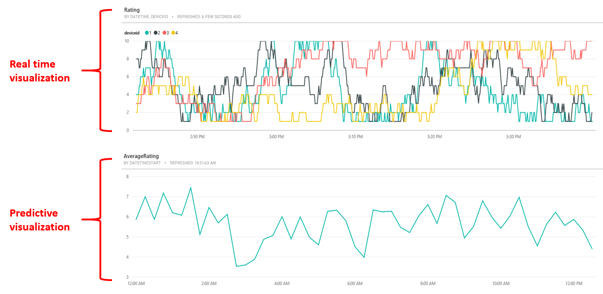

<properties
	pageTitle="Setting up predictive analytics pipelines using Azure SQL Data Warehouse | Microsoft Azure"
	description="Setting up predictive analytics pipelines using Azure SQL Data Warehouse."
	keywords="adf, azure data factory"
	services="sql-data-warehouse,data-factory,event-hubs,machine-learning,service-bus,stream-analytics"
	documentationCenter=""
	authors="roalexan"
	manager="paulettm"
	editor=""/>

<tags
	ms.service="sql-data-warehouse"
	ms.workload="data-services"
	ms.tgt_pltfrm="na"
	ms.devlang="na"
	ms.topic="article"
	ms.date="04/04/2016"
	ms.author="roalexan" />

# Setting up predictive analytics pipelines using Azure SQL Data Warehouse

*This post is by Robert Alexander, Solution Architect at the Machine Learning Team at Microsoft.*

Big data is big and it's getting bigger. Better get used to a whole new set of <a href="https://en.wikipedia.org/wiki/Metric_prefix">prefixes</a> beyond peta such as exa, zetta, and yotta. According to this <a href="http://www.emc.com/collateral/analyst-reports/idc-the-digital-universe-in-2020.pdf">report</a> by IDC, the amount of data will "double every two years until by 2020 the digital universe will reach 44 zettabytes, or 44 trillion gigabytes - nearly as many digital bits as there are stars in the universe".

The sheer size of data presents businesses with 

When approaching how to deal with big data, certain patterns begin to emerge: the need to move and store vast amounts of data, to analyze the data, and to visualize the relationships patterns. Securely, quickly, costly. Many technologies have emerged to help analyze and map reduce distribued query processing MPP databases, distributed file systems manufacturing, healthcare, education, media, Internet of Thing, retail, banking,

big data - competetive advantage democratize the data more precision segmentation improve decision making minimize risks find insights otherwise hidden break down silos r&d, engineering, manufacturing, service experimentation real-time personalization Internet purchases, social-network conversations, and, more recently, location-specific smart phone interactions new businesses cost reduction, faster better decision making new products and services obstacle or opportunity

Microsoft has been hard at work building solutions in the big data space. For data storage we have <a href="https://azure.microsoft.com/en-us/documentation/articles/sql-data-warehouse-overview-what-is"/>Azure SQL Data Warehouse</a>, a cloud-based, scalable database capable of processing massive volumes of data. It is ideally suited for storing structured data with a defined schema. Due to it's <a href="https://technet.microsoft.com/en-us/library/hh393582%28v=sql.110%29.aspx"/>MPP</a> architecture and use of Azure storage, it provides optimized query performance along with the ability to grow or shrink storage and compute independently. SQL Data Warehouse uses SQL Server's Transact-SQL (<a href="https://msdn.microsoft.com/en-us/library/mt243830.aspx"/>TSQL</a>) syntax for many operations and supports a broad set of traditional SQL constructs such as stored procedures, user-defined functions, table partitioning, indexes, and collations. It is integrated with traditional SQL Server and third party tools, along with many services in Azure such as <a href="https://azure.microsoft.com/en-us/services/data-factory/"/>Azure Data Factory</a>, <a href="https://azure.microsoft.com/en-us/services/stream-analytics/"/>Stream Analytics</a>, <a href="https://azure.microsoft.com/en-us/services/machine-learning/">Machine Learning</a>, and <a href="https://powerbi.microsoft.com/en-us/"/>Power BI</a>.

For machine learning we have <a href="https://azure.microsoft.com/en-us/services/machine-learning/">Azure Machine Learning</a>. learning what is it

To demonstrate the power of <a href="https://azure.microsoft.com/en-us/documentation/articles/sql-data-warehouse-overview-what-is"/>Azure SQL Data Warehouse</a> and <a href="https://azure.microsoft.com/en-us/services/machine-learning/">Azure Machine Learning</a> we have published a <a href="https://github.com/Azure/CAS-Gallery-Content/tree/master/Tutorials/SQL-Data-Warehouse"/>tutorial</a> that shows how to deploy an end-to-end realtime and predictive pipeline in your Azure subscription. Along the way you will see in use a number of other Azure services, including <a href="https://azure.microsoft.com/en-us/services/event-hubs/"/>Event Hub</a>, <a href="https://azure.microsoft.com/en-us/services/stream-analytics/"/>Stream Analytics</a>, and <a href="https://powerbi.microsoft.com/en-us/"/>Power BI</a> - as well as an on-prem SQL Server via a <a href="https://msdn.microsoft.com/en-us/library/dn879362.aspx"/>Data Management Gateway</a>. Go check it out! You will learn how to add predictive pipelines to a data warehouse augmented with machine learning. At the end of this tutorial you will have a full end-to-end solution deployed in your Azure subscription.

images of all these technolgies

This tutorial will cover several useful design patterns that you can use. It consists of a realtime and a predictive pipeline. For the realtime pipeline, you will see how Stream Analytics can read from an EventHub and send the data to PowerBI for visualization. For the predictive pipeline, you will see how Stream Analytics can also send the data to Azure SQL Data Warehouse, where an Azure Data Factory will call Azure Machine Learning to read the data from the warehouse and send the aggregated results back to the warehouse for visualization in PowerBI. In addition, you will see how historical batch data can be ingested from an on-prem SQL Server via Data Management Gateway to Azure SQL Data Warehouse.

The underlying architecture is as follows:

When everything is successfully deployed and running, the final result will be a PowerBI dashboard showing the ratings of each individual device in real time and the average rating for all devices.

So again, click <a href="https://github.com/Azure/CAS-Gallery-Content/tree/master/Tutorials/SQL-Data-Warehouse"/>here</a> to check out the tutorial and get started!
