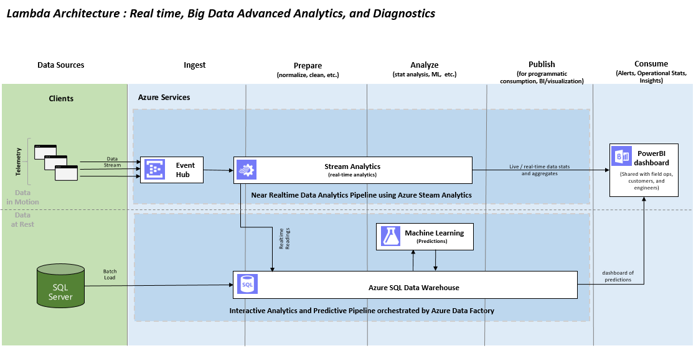

<properties
	pageTitle="ADF Data Movement from IaaS AWS SQLServer to Azure Blob and SQLServer | Microsoft Azure"
	description="Describes the steps needed to copy data from an IaaS AWS/EC2 SQLServer to Azure Blob and SQLServer."
	keywords="adf, azure data factory"
	services="datafactory"
	documentationCenter=""
	authors="roalexan"
	manager="paulettm"
	editor=""/>

<tags
	ms.service="datafactory"
	ms.workload="data-services"
	ms.tgt_pltfrm="na"
	ms.devlang="na"
	ms.topic="article"
	ms.date="02/23/2016"
	ms.author="roalexan" />

# New Gallery Sample - Setting up predictive analytics pipelines using Azure SQL Data Warehouse

To demonstrate the power of Azure SQL Data Warehouse we have published a <a href="https://github.com/roalexan/SolutionArchitects"/>gallery sample</a> that examines a sample use case that integrates SQL Data Warehouse with a number of Azure components, namely Event Hub, Stream Analytics, Machine Learning, and Power BI - as well as an on-prem SQL Server via a Data Management Gateway. At the end of this gallery sample are included the steps to deploy it in your Azure subscription.

The underlying architecture is as follows:

When everything is successfully deployed and running, the final result will be a PowerBI dashboard showing the ratings of each individual device in real time and the average rating for all four devices.

Here is a screenshot of a sample dashboard:

## Azure SQL Data Warehouse

 <a href="https://azure.microsoft.com/en-us/documentation/articles/sql-data-warehouse-overview-what-is"/>Azure SQL Data Warehouse</a> is a cloud-based, scalable database capable of processing massive volumes of data. It is ideally suited for storing structured data with a defined schema. Due to it's <a href="https://technet.microsoft.com/en-us/library/hh393582%28v=sql.110%29.aspx"/>MPP</a> architecture and use of Azure storage, it provides optimized query performance along with the ability to grow or shrink storage and compute independently. SQL Data Warehouse uses SQL Server's Transact-SQL (<a href="https://msdn.microsoft.com/en-us/library/mt243830.aspx"/>TSQL</a>) syntax for many operations and supports a broad set of traditional SQL constructs such as stored procedures, user-defined functions, table partitioning, indexes, and collations. It is integrated with traditional SQL Server and third party tools, along with many services in Azure such as <a href="https://azure.microsoft.com/en-us/services/data-factory/"/>Azure Data Factory</a>, <a href="https://azure.microsoft.com/en-us/services/stream-analytics/"/>Stream Analytics</a>, <a href="https://azure.microsoft.com/en-us/services/machine-learning/">Machine Learning</a>, and <a href="https://powerbi.microsoft.com/en-us/"/>Power BI</a>.