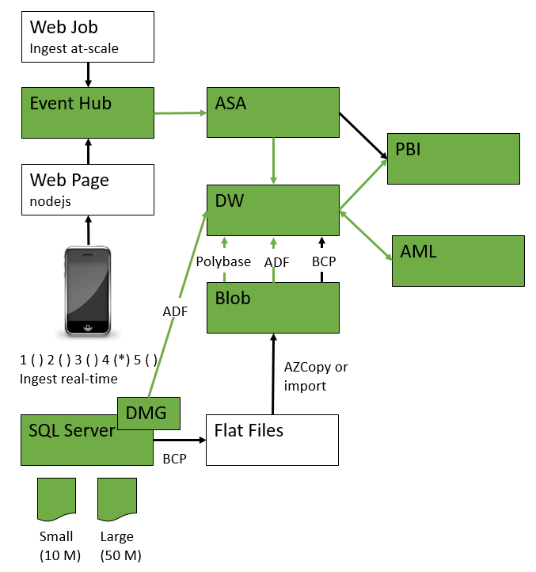
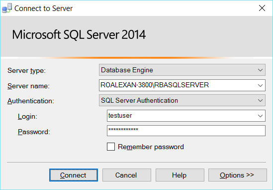

<properties
	pageTitle="ADF Data Movement from IaaS AWS SQLServer to Azure Blob and SQLServer | Microsoft Azure"
	description="Describes the steps needed to copy data from an IaaS AWS/EC2 SQLServer to Azure Blob and SQLServer."
	keywords="adf, azure data factory"
	services="datafactory"
	documentationCenter=""
	authors="roalexan"
	manager="paulettm"
	editor=""/>

<tags
	ms.service="datafactory"
	ms.workload="data-services"
	ms.tgt_pltfrm="na"
	ms.devlang="na"
	ms.topic="article"
	ms.date="02/23/2016"
	ms.author="roalexan" />

# Setting up predictive analytics pipelines using Azure SQL Data Warehouse

## Use case

Fill in  - one paragraph

## Architecture

## Prerequisites

- Microsoft Azure subscription with login credentials
- Microsoft SQL Server Management Studio
- Local SQL Server with Data Management Gateway

## Populate Local SQL Server

* make database
* make table
* populate table

## Get Latest PowerShell

Download the Azure PowerShell module. Run Microsoft Web Platform Installer. http://go.microsoft.com/fwlink/p/?linkid=320376&clcid=0x409

## Create Azure Resource Group

* Login-AzureRmAccount
* Select-AzureRmSubscription -SubscriptionID "bc4170f0-cc6e-49d2-ba65-bc00a7a4df6b"
* New-AzureRmResourceGroup -Name rbaResourceGroup3 -Location "Central US"

## Create V12 Azure SQL Server

New-AzureRmResourceGroupDeployment -Name rbaDeployment3 -ResourceGroupName rbaResourceGroup3 -TemplateFile "C:\Users\roalexan\Source\Repos\SolutionArchitects\Collateral\Gallery Samples\SQL Data Warehouse\deploy-sqlserver.json"

New-AzureRmResourceGroupDeployment -Name rbaDeployment3 -ResourceGroupName rbaResourceGroup3 -TemplateUri https://raw.githubusercontent.com/roalexan/SolutionArchitects/c7505f45a5a7985e58c9a52efad77085b47647a7/Collateral/Gallery%20Samples/SQL%20Data%20Warehouse/deploy-sqlserver.json

## Create Azure SQL Data Warehouse

New-AzureRmSqlDatabase -RequestedServiceObjectiveName "<Service Objective>" -DatabaseName "<Data Warehouse Name>" -ServerName "<Server Name>" -ResourceGroupName "<ResourceGroupName>" -Edition "DataWarehouse"

New-AzureRmSqlDatabase -RequestedServiceObjectiveName "DW400" -DatabaseName "mynewsqldw1" -ServerName "personal-rba" -ResourceGroupName "rbaResourceGroup3" -Edition "DataWarehouse"

* make table

      IF OBJECT_ID('dbo.Events', 'U') IS NOT NULL DROP TABLE dbo.Events
      IF OBJECT_ID('dbo.Ratings', 'U') IS NOT NULL DROP TABLE dbo.Ratings

      CREATE TABLE dbo.Events(
      EventId INT,
      EventName NVARCHAR(50) NOT NULL,
      Speakers NVARCHAR(200) NOT NULL,
      Topics NVARCHAR(200) NOT NULL,
      Country NVARCHAR(50) NOT NULL,
      State NVARCHAR(50) NOT NULL,
      City NVARCHAR(50) NOT NULL
      CONSTRAINT PK_Events PRIMARY KEY(EventId)
      )

      CREATE TABLE dbo.Ratings(
      DateTime DATETIME2(7),
      EventId INT,
      Rating INT
      CONSTRAINT PK_Ratings PRIMARY KEY(DateTime)
      )

### Deploy Azure SQL Server

* provision
* make user
* make database
* make table

      IF OBJECT_ID('dbo.Events', 'U') IS NOT NULL DROP TABLE dbo.Events
	  IF OBJECT_ID('dbo.Ratings', 'U') IS NOT NULL DROP TABLE dbo.Ratings

      CREATE TABLE dbo.Events(
	    EventId INT,
	    EventName NVARCHAR(50) NOT NULL,
	    Speakers NVARCHAR(200) NOT NULL,
	    Topics NVARCHAR(200) NOT NULL,
	    Country NVARCHAR(50) NOT NULL,
	    State NVARCHAR(50) NOT NULL,
	    City NVARCHAR(50) NOT NULL
	    CONSTRAINT PK_Events PRIMARY KEY(EventId)
      )

      CREATE TABLE dbo.Ratings(
	    DateTime DATETIME2(7),
	    EventId INT,
	    Rating INT
	    CONSTRAINT PK_Ratings PRIMARY KEY(DateTime)
      )

      INSERT INTO dbo.Events  VALUES(1234,'MLADS','roalexan,jacrowle','sqldw,dl','USA','WA','Redmond')

      INSERT INTO dbo.Ratings VALUES('08/13/2015 00:15:07',1234,5)
      INSERT INTO dbo.Ratings VALUES('08/13/2015 00:16:07',1234,1)
      INSERT INTO dbo.Ratings VALUES('08/13/2015 00:17:07',1234,3)

## Create Pipeline From Local SQL Server to Azure SQL Data Warehouse

# OLD STUFF

### Using Local File

    New-AzureRmResourceGroupDeployment -Name rbaDeployment3 -ResourceGroupName rbaResourceGroup3 -TemplateFile C:\microsoft\sqldatawarehouse\arm\mine\deploy-storageaccount.json -TemplateParameterFile C:\microsoft\sqldatawarehouse\arm\mine\deploy-storageaccount-parameters.json

### Using URI

    New-AzureRmResourceGroupDeployment -Name rbaDeployment3 -ResourceGroupName rbaResourceGroup3 -TemplateUri https://raw.githubusercontent.com/roalexan/SolutionArchitects/10ce462255ba0199f7b06492bbf9fed9ed6d82ec/Collateral/Gallery%20Samples/SQL%20Data%20Warehouse/deploy-storageaccount.json -TemplateParameterFile C:\microsoft\sqldatawarehouse\arm\mine\deploy-storageaccount-parameters.json

## Install local SQL Server

## Create database

Expand: **SERVERNAME**, right click: **Databases**: select: **New Database...**, type: Database name: **SQLSERVERDATABASENAME** # Up to user, click: **OK**

## Create table and populate with data

Expand: **Databases**, right click: **SQLSERVERDATABASENAME**: New Query

Copy below text and paste into query window

	IF OBJECT_ID('dbo.SystemEvents', 'U') IS NOT NULL DROP TABLE dbo.SystemEvents
	CREATE TABLE dbo.SystemEvents(DateTime DATETIME2(7) NOT NULL,ComputerName NVARCHAR(50) NOT NULL, EventID NVARCHAR(50),EventMessage NVARCHAR(500) CONSTRAINT PK_SystemEvents PRIMARY KEY CLUSTERED(DateTime,ComputerName))
	INSERT INTO dbo.SystemEvents VALUES('08/13/2015 00:15:07.262','MACHINE1','3','System Reboot')

Click: **Execute**

## Install Datamanagement gateway locally
## Create table in local SQL Server

## Undeploy

    Remove-AzureRmResourceGroup -Name rbaResourceGroup3

## Appendix create Datamanagement gateway

## Appendix small/large populate tables

## Useful Links

https://azure.microsoft.com/en-us/documentation/templates/101-storage-account-create/
https://azure.microsoft.com/en-us/documentation/articles/resource-group-authoring-templates/
https://msdn.microsoft.com/en-us/library/mt603823.aspx
https://azure.microsoft.com/en-us/documentation/articles/powershell-azure-resource-manager/
https://blogs.technet.microsoft.com/dataplatforminsider/2014/07/30/transitioning-from-smp-to-mpp-the-why-and-the-how/
https://azure.microsoft.com/en-us/documentation/articles/sql-data-warehouse-overview-what-is/
https://github.com/Azure/azure-quickstart-templates
https://azure.microsoft.com/en-us/documentation/articles/resource-manager-supported-services/
https://azure.microsoft.com/en-us/documentation/articles/sql-data-warehouse-get-started-provision-powershell/
https://azure.microsoft.com/en-us/documentation/articles/sql-data-warehouse-overview-develop/
