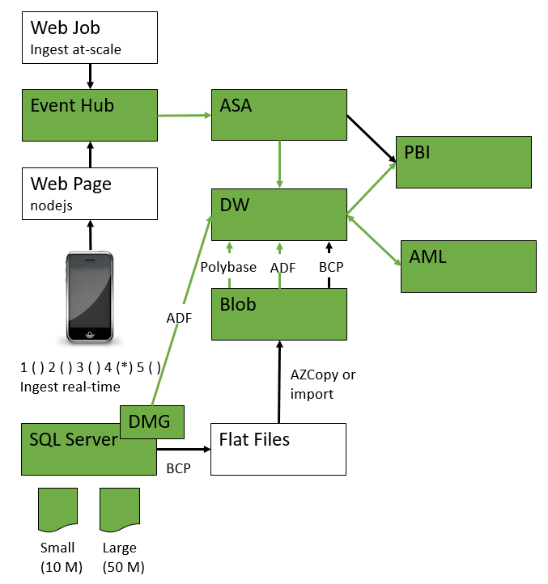

<properties
	pageTitle="ADF Data Movement from IaaS AWS SQLServer to Azure Blob and SQLServer | Microsoft Azure"
	description="Describes the steps needed to copy data from an IaaS AWS/EC2 SQLServer to Azure Blob and SQLServer."
	keywords="adf, azure data factory"
	services="datafactory"
	documentationCenter=""
	authors="roalexan"
	manager="paulettm"
	editor=""/>

<tags
	ms.service="datafactory"
	ms.workload="data-services"
	ms.tgt_pltfrm="na"
	ms.devlang="na"
	ms.topic="article"
	ms.date="02/23/2016"
	ms.author="roalexan" />

# Setting up predictive analytics pipelines using Azure SQL Data Warehouse

## Use Case

Fill in  - one paragraph

## Architecture

## Prerequisites

- Microsoft Azure subscription with login credentials
- PowerBI subscription with login credentials
- SQL client (Example: Microsoft SQL Server Management Studio)

## Deploy

### Resources

Many of the resources (SQL Server V12, SQL Warehouse, Service Bus, Event Hub, Stream Analytics Job) are deployed automatically when you click the **Deploy to Azure button**.

<a href="https://portal.azure.com/#create/Microsoft.Template/uri/https%3A%2F%2Fraw.githubusercontent.com%2Froalexan%2FSolutionArchitects%2Fmaster%2Fazuredeploy.json" target="_blank">
    
</a>

Screenshots on how to set parameters.

<!--
<a href="http://armviz.io/#/?load=https%3A%2F%2Fraw.githubusercontent.com%2Froalexan%2FSolutionArchitects%2Fmaster%2Fazuredeploy.json" target="_blank">
    
</a>
-->

### Create Azure SQL Data Warehouse tables

1. Connect to the Data Warehouse using a SQL client of your choice. For example:
   1. Start: **Microsoft SQL Server Management Studio**
   1. Click: **File** > **Connect Object Explorer...**
   1. Select: Server type: **Database Engine**
   1. Type: Server name: **personal-[*UNIQUE*].database.windows.net**
   1. Select: Authentication: **SQL Server Authentication**
   1. Type: Login: **personaluser**
   1. Type: Password: **pass@word1**
   1. Check: **Remember password** # Optional
  1. Click: **Connect**
1. Create the tables. For example:
	 1. Expand: **personal-[*UNIQUE*].database.windows.net** > Databases > **personalDB**
	 1. Click: **New Query** # You may safely ignore the warning concerning QueryGovernorCostLimit if you see it
	 1. Copy and Paste:
            CREATE TABLE Ratings (
               DateTime DATETIME2,
               EventId INT,
               Rating INT,
               DeviceId INT,
               Lat DECIMAL(8,5),
               Lon DECIMAL(8,5)
            )
            WITH (
               DISTRIBUTION = HASH(DateTime),
               CLUSTERED COLUMNSTORE INDEX
		    )
     1. Click: **Execute**

### Edit and start the ASA job

1. Browse: https://manage.windowsazure.com
1. Click: **personalstreamanalytics<unique>**
1. Click: **OUTPUTS**
1. Click: **ADD OUTPUT**
1. Select: **Power BI**
1. Click: **Next**
1. Click: **Authorize Now** # Login with your credentials
1. Type: OUTPUT ALIAS: **OutputPowerBI**
1. Type: DATASET NAME: **personalDB** # This dataset will be overwritten in PBI should it already exist
1. Type: TABLE NAME: **personalDB**
1. Select: WORKSPACE: **My Workspace** # Default
1. Click: **Finish**
1. Click: **Start**
1. Click: **Finish** # You do not need to specify a custom time

### Download and run the data generator

1. Download **debug.zip**
1. Unzip
1. Edit: **Rage.exe.config**
1. Replace: EVENTHUBNAME: With: **personaleventhub[*UNIQUE*]**
1. Browse: https://manage.windowsazure.com # Get the endpoint
1. Click: SERVICE BUS
1. Click: CONNECTION INFORMATION
1. Copy: CONNECTION STRING
1. Replace: ENDPOINT: With: CONNECTION STRING
1. Double click: **Rage.exe** # Runs until you click any key on the console

#### Verify data being written

##### From Portal

1. Browse: https://manage.windowsazure.com
1. Click: **personalstreamanalytics[*UNIQUE*]**
1. Click: DASHBOARD
1. Click: **Operation Logs**
1. Select: a recent log
1. Click: DETAILS

##### From SQL Client

1. Connect to the Data Warehouse using a SQL client of your choice
1. Run SQL to view the latest entries. For example:
   1. Expand: **personal-[*UNIQUE*].database.windows.net** > Databases > **personalDB**
   1. Click: **New Query** # You may safely ignore the warning concerning QueryGovernorCostLimit if you see it
   1. Copy and Paste:
	      select * from Ratings order by DateTime desc;
   1. Click: **Execute**

### Create the PBI dashboard

1. Browse: https://powerbi.microsoft.com
1. Click: **Sign in** # Login with your credentials
1. Show: The navigation pane
1. Click: **personalDB** # Under the Datasets folder
1. Click: **Line chart** # Under Visualizations
1. Drag: **datetime**: To: **Axis**
1. Drag: **deviceid**: To: **Legend**
1. Drag: **rating**: To: **Values**

## Create the AML service

## Undeploy
