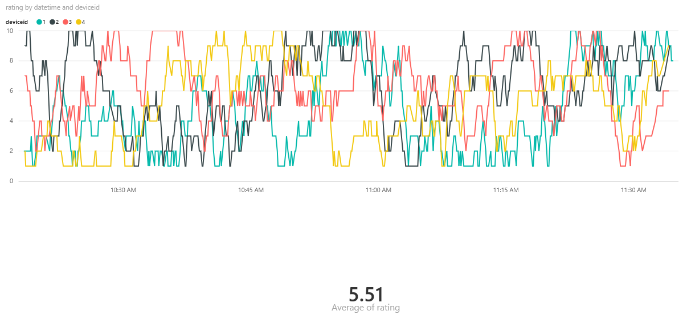

<properties
	pageTitle="ADF Data Movement from IaaS AWS SQLServer to Azure Blob and SQLServer | Microsoft Azure"
	description="Describes the steps needed to copy data from an IaaS AWS/EC2 SQLServer to Azure Blob and SQLServer."
	keywords="adf, azure data factory"
	services="datafactory"
	documentationCenter=""
	authors="roalexan"
	manager="paulettm"
	editor=""/>

<tags
	ms.service="datafactory"
	ms.workload="data-services"
	ms.tgt_pltfrm="na"
	ms.devlang="na"
	ms.topic="article"
	ms.date="02/23/2016"
	ms.author="roalexan" />

# Setting up predictive analytics pipelines using Azure SQL Data Warehouse

## Azure SQL Data Warehouse

 <a href="https://azure.microsoft.com/en-us/documentation/articles/sql-data-warehouse-overview-what-is"/>Azure SQL Data Warehouse</a> is a cloud-based, scalable database capable of processing massive volumes of data. It is ideally suited for storing structured data with a defined schema. Due to it's <a href="https://technet.microsoft.com/en-us/library/hh393582%28v=sql.110%29.aspx"/>MPP</a> architecture and use of Azure storage, it provides optimized query performance along with the ability to grow or shrink storage and compute independently. SQL Data Warehouse uses SQL Server's Transact-SQL (<a href="https://msdn.microsoft.com/en-us/library/mt243830.aspx"/>TSQL</a>) syntax for many operations and supports a broad set of traditional SQL constructs such as stored procedures, user-defined functions, table partitioning, indexes, and collations. It is integrated with traditional SQL Server and third party tools, along with many services in Azure such as <a href="https://azure.microsoft.com/en-us/services/data-factory/"/>Azure Data Factory</a>, <a href="https://azure.microsoft.com/en-us/services/stream-analytics/"/>Stream Analytics</a>, <a href="https://azure.microsoft.com/en-us/services/machine-learning/">Machine Learning</a>, and <a href="https://powerbi.microsoft.com/en-us/"/>Power BI</a>.

## Use Case

To demonstrate the power of Azure SQL Data Warehouse we will examine a sample use case that integrates SQL Data Warehouse with a number of Azure components, namely Event Hub, Stream Analytics, Machine Learning, and Power BI - as well as an on-prem SQL Server via a Data Management Gateway. At the end of this gallery we will include the steps to deploy this use case in your Azure subscription.

The architecture is described in detail below.

The use case is a rating system that allows users to rate an event (such as a conference talk) and visualize the results in real time (currently 5 second intervals). Ratings are also stored in a data warehouse and sent to machine learning for near real time predictions (currently 15 minute intervals). Lastly, historical ratings can be bulk-loaded from an on-prem database.

Real time ratings are generated via a data generator deployed as an <a href="https://azure.microsoft.com/en-us/documentation/articles/web-sites-create-web-jobs/">Azure Web Job</a>. New ratings are randomly generated every 5 seconds for four fictitious devices (and one fictitious event) and sent to an Event Hub. An Azure Stream Analytics job then sends the ratings to a) Power BI for real time visualization and b) SQL Data Warehouse for storage and predictive analytics

Predictive analytics is done by sending the ratings from SQL Data Warehouse to the batch endpoint of an experiment published as a web service in the Azure Machine Learning Studio, where the results are written back to SQL Data Warehouse. An Azure Data Factory orchestrates these operations. Note that for the purposes of this gallery sample we are not using a trained model in the experiment. For now, the experiment simply returns the average rating for the event. Going forward, we will improve this sample to compute the average in Stream Analytics and do predictions based on location, event type, and device counts.

Bulk-loading is done by creating the schema in an on-prem SQL Server and populating the table with sample ratings data (downloadable from GitHub). A Data Management Gateway is used in the on-prem environment to connect the SQL Server to Azure SQL Data Warehouse. A Data Factory schedules the copying of the data from on-prem SQL Server to SQL Data Warehouse.

When everything is successfully deployed and running, the final result will be a PowerBI dashboard showing the ratings of each individual device in real time and the average rating for all four devices.

Here is a screenshot of a sample dashboard.

## Requirements

- Microsoft Azure subscription with login credentials
- PowerBI subscription with login credentials
- A local environment with
    - SQL Server
    - Data Management Gateway
    - A SQL client (Example: Microsoft SQL Server Management Studio)

## Deploy

### Service Bus, Event Hub, Stream Analytics Job, SQL Server, and SQL Data Warehouse

Click this button

<a href="https://portal.azure.com/#create/Microsoft.Template/uri/https%3A%2F%2Fraw.githubusercontent.com%2Froalexan%2FSolutionArchitects%2Fmaster%2Fazuredeploypart1.json" target="_blank">
    
</a>

This will create a new "blade" in the Azure portal.

1. Parameters
   1. Type: UNIQUE (string): **[*UNIQUE*]** # Select a globally unique string
   1. Select: LOCATION: **[*LOCATION*]** # The region where everything will be deployed
   1. Click: **OK**
1. Select: Subscription: **[*SUBSCRIPTION*]** # Name of the Azure subscription you want to use
1. Resource group
   1. Select: **New**
   1. Type: New resource group name: **[*UNIQUE*]** # Same as above
1. Select: Resource group location: **[*LOCATION*]** # Same as above
1. Check: **Pin to dashboard** # If you want it on your dashboard
1. Click: **Create**

### Create Azure SQL Data Warehouse tables

1. Connect to the Data Warehouse using a SQL client of your choice. For example:
   1. Start: **Microsoft SQL Server Management Studio**
   1. Click: **File** > **Connect Object Explorer...**
   1. Select: Server type: **Database Engine**
   1. Type: Server name: **personal-[*UNIQUE*].database.windows.net**
   1. Select: Authentication: **SQL Server Authentication**
   1. Type: Login: **personaluser**
   1. Type: Password: **pass@word1**
   1. Check: **Remember password** # Optional
  1. Click: **Connect**
1. Create the tables. For example:
	 1. Expand: **personal-[*UNIQUE*].database.windows.net** > Databases > **personalDB**
	 1. Click: **New Query** # You may safely ignore the warning concerning QueryGovernorCostLimit if you see it
	 1. Copy and Paste:
            CREATE TABLE Ratings (
               DateTime DATETIME2,
               EventId INT,
               Rating INT,
               DeviceId INT,
               Lat DECIMAL(8,5),
               Lon DECIMAL(8,5)
            )
            WITH (
               DISTRIBUTION = HASH(DateTime),
               CLUSTERED COLUMNSTORE INDEX
		    )
            CREATE TABLE AverageRatings (
	           EventId INT,
	           AverageRating FLOAT
            )
            WITH (
	           CLUSTERED COLUMNSTORE INDEX
            )
     1. Click: **Execute**

### Create the AML service

1. Browse: https://studio.azureml.net
1. Click: **Sign** In # Login with your credentials
1. Click: Experiments > NEW
1. Click: Blank Experiment
1. Expand: Data Input and Output
1. Drag: Reader: To: Canvas
1. Select: Data source: Azure SQL Database
1. Type: Database server name: **personal-[*UNIQUE*].database.windows.net**
1. Type: Database name: personalDB
1. Type: Server user account name: personaluser
1. Type: Server user account password: pass@word1
1. Uncheck: Accept any server certificate (insecure): No # Default
1. Type: Database query:
      SELECT
      CAST(Rating AS INT) AS Rating
      FROM Ratings
      WHERE EventId = 1
1. Click: Database server name: web service parameter
1. Click: Database name: web service parameter
1. Click: Server user account name: web service parameter
1. Click: Server user account password: web service parameter
1. Click: Database query: web service parameter
1. Expand: Statistical Functions
1. Drag: Compute Elementary Statistics: To: Canvas
1. Select: Method: Mean
1. Connect: Reader: With: Compute Elementary Statistics
1. Expand: Web Service
1. Drag: Output: To: Canvas
1. Connect: Compute Elementary Statistics: Web service output
1. Click: RUN
1. Right Click: Compute Elementary Statistics
1. Select: Visualize # Verify that the mean output is reasonable
1. Click: Close
1. Click: SAVE AS
1. Type: Experiment name: Ratings
1. Click: SET UP WEB SERVICE
1. Click: NEXT > NEXT > NEXT > FINISH
1. Click: RUN
1. Click: DEPLOY WEB SERVICE
1. Click: TEST # Verify that request/response works
1. Click: DATABASE QUERY:
      SELECT
      CAST(Rating AS INT) AS Rating
      FROM Ratings
      WHERE EventId = 1
1. Click: DATABASE SERVER NAME: **personal-[*UNIQUE*].database.windows.net**
1. Click: DATABASE NAME: personalDB
1. Click: SERVER USER ACCOUNT NAME: personaluser
1. Click: SERVER USER ACCOUNT PASSWORD: pass@word1
1. Click: OK

### Edit and start the ASA job

1. Browse: https://manage.windowsazure.com
1. Click: **personalstreamanalytics<unique>**
1. Click: **OUTPUTS**
1. Click: **ADD OUTPUT**
1. Select: **Power BI**
1. Click: **Next**
1. Click: **Authorize Now** # Login with your credentials
1. Type: OUTPUT ALIAS: **OutputPowerBI**
1. Type: DATASET NAME: **personalDB** # This dataset will be overwritten in PBI should it already exist
1. Type: TABLE NAME: **personalDB**
1. Select: WORKSPACE: **My Workspace** # Default
1. Click: **Finish**
1. Click: **Start**
1. Click: **Finish** # You do not need to specify a custom time

### Download and run the data generator

1. Download **debug.zip**
1. Unzip
1. Edit: **Rage.exe.config**
1. Replace: EVENTHUBNAME: With: **personaleventhub[*UNIQUE*]**
1. Browse: https://manage.windowsazure.com # Get the endpoint
1. Click: SERVICE BUS
1. Click: CONNECTION INFORMATION
1. Copy: CONNECTION STRING
1. Replace: ENDPOINT: With: CONNECTION STRING
1. Double click: **Rage.exe** # Runs until you click any key on the console

#### Verify data being written

##### From Portal

1. Browse: https://manage.windowsazure.com
1. Click: **personalstreamanalytics[*UNIQUE*]**
1. Click: DASHBOARD
1. Click: **Operation Logs**
1. Select: a recent log
1. Click: DETAILS

##### From SQL Client

1. Connect to the Data Warehouse using a SQL client of your choice
1. Run SQL to view the latest entries. For example:
   1. Expand: **personal-[*UNIQUE*].database.windows.net** > Databases > **personalDB**
   1. Click: **New Query** # You may safely ignore the warning concerning QueryGovernorCostLimit if you see it
   1. Copy and Paste:
	      select * from Ratings order by DateTime desc;
   1. Click: **Execute**

### Create the realtime ADF

Browse: https://portal.azure.com
Click: Data factories
Click: Add
Type: Name: datafactory-rba10
Select: Subscription: Boston Engineering
Select: Resource group name: rba10
Select: Region name: West US
Check: Pin to dashboard # The default
Click: Create
Click: Author and deploy

Click: New data store
Select: Azure SQL Data Warehouse
Replace: <servername>: With: personal-rba10
Replace: <databasename>: With: personalDB
Replace: <username>: With: personaluser
Replace: <servername>: With: personal-rba10
Replace: <password>: With: pass@word1
Click: Deploy

Browse: https://studio.azureml.net
Click: Sign In # Login with your credentials
Click: WEB SERVICES
Click: Ratings
Click: Copy # APIKEY
Click: BATCH EXECUTION
Copy: https://...jobs # BESURL
Click: New compute
Select: Azure ML
Replace: <Specify the batch scoring URL>: With: BESURL
Replace: <Specify the published workspace model's API key>: With: APIKEY
Remove: Line: Containing: updateResourceEndpoint
Remove: comma from preceding line
Click: Deploy

Click: New dataset
Select: Azure SQL Data Warehouse
Edit: linkedServiceName: AzureSqlDWLinkedService
Edit: tableName: Ratings
Edit: frequency: Minute
Edit: interval: 15 # Remove surround double quotes. 15 minutes is the minimum allowed.
Click: Deploy

Click: New dataset
Select: Azure SQL Data Warehouse
Edit: name: AzureSqlDWOutput
Edit: linkedServiceName: AzureSqlDWLinkedService
Edit: tableName: AverageRatings
Edit: frequency: Minute
Edit: interval: 15 # Remove surround double quotes. 15 minutes is the minimum allowed.
Click: Deploy

Click: More commands
Click: New pipeline
Edit:
{
    "name": "SQL-to-AML-to-SQL",
    "properties": {
        "description": "SQL to AML to SQL",
        "activities": [
            {
                "type": "AzureMLBatchScoring",
                "typeProperties": {
                    "webServiceParameters": {
                        "Database server name": "personal-rba10.database.windows.net",
                        "Database name": "personalDB",
                        "Server user account name": "personaluser",
                        "Server user account password": "pass@word1",
                        "Database query": "SELECT CAST(Rating AS INT) AS Rating FROM Ratings WHERE EventId = 1"
                    }
                },
                "inputs": [
                    {
                        "name": "AzureSqlDWInput"
                    }
                ],
                "outputs": [
                    {
                        "name": "AzureSqlDWOutput"
                    }
                ],
                "policy": {
                    "timeout": "00:05:00",
                    "concurrency": 1,
                    "retry": 3
                },
                "scheduler": {
                    "frequency": "Minute",
                    "interval": 15
                },
                "name": "MLActivity",
                "description": "prediction analysis on batch input",
                "linkedServiceName": "AzureMLLinkedService"
            }
        ],
        "start": "2016-03-25T15:00:00Z",
        "end": "2016-03-25T16:00:00Z",
        "isPaused": false,
        "pipelineMode": "Scheduled"
    }
}
Click: Deploy

### Create the batch ADF

Browse: https://portal.azure.com
Click: Data factories
Click: Add
Type: Name: datafactory-sqldb-sqldw-rba10
Select: Subscription: Boston Engineering
Select: Resource group name: rba10
Select: Region name: West US
Check: Pin to dashboard # The default
Click: Create
Click: Author and deploy

Click:More commands
Click:New data gateway
Type:Data gateway name:datagateway-rba10
Click:OK
	KEY:ADF#41571b47-fd2a-4daa-b54b-7f6e69a6b71c@bc4170f0-cc6e-49d2-ba65-bc00a7a4df6b@7be89d3f-00b8-453f-9bd6-ddc98e58de74@wu#JIYIGu+q4+T0aHA1WEyKhbzNSHahQet4rLNKd0jpk0A=

Click: New data store
Select: SQL Server
Replace: <servername>: With: WIN-DIFB3TPU2L9
Replace: <databasename>: With: personalDB
Replace: <username>: With: sqluser1
Replace: <servername>: With: personal-rba10
Replace: <password>: With: EY65t3yBn4se
Replace: <gateway>: With: datagateway-rba10
Remove: <user name>
Remove: <password>
Click: Deploy

Add: # After availability
        "external": true,
        "policy": {}

Click: New data store
Select: Azure SQL Data Warehouse
Replace: <servername>: With: personal-rba10
Replace: <databasename>: With: personalDB
Replace: <username>: With: personaluser
Replace: <servername>: With: personal-rba10
Replace: <password>: With: pass@word1
Click: Deploy

Click: New dataset
Select: SQL Server table
Edit: linkedServiceName: SqlServerLinkedService
Edit: tableName: Ratings
Edit: frequency: Minute
Edit: interval: 15 # Remove surround double quotes. 15 minutes is the minimum allowed.
Click: Deploy

Click: New dataset
Select: Azure SQL Data Warehouse
Edit: linkedServiceName: AzureSqlDWLinkedService
Edit: tableName: Ratings
Edit: frequency: Minute
Edit: interval: 15 # Remove surround double quotes. 15 minutes is the minimum allowed.
Click: Deploy

Click: More commands
Click: New pipeline
Edit:
{
    "name": "SQLDB-to-SQLDW-pipeline",
    "properties": {
        "description": "On Prem SQL Server DB to Azure SQL Server Data Warehouse",
        "activities": [
            {
                "type": "Copy",
                "typeProperties": {
                    "source": {
                        "type": "SqlSource",
                        "sqlReaderQuery": "select * from Ratings"
                    },
                    "sink": {
                        "type": "SqlSink",
                        "writeBatchSize": 1000,
                        "writeBatchTimeout": "00:30:00"
                    }
                },
                "inputs": [
                    {
                        "name": "SQLServerDatasetTemplate"
                    }
                ],
                "outputs": [
                    {
                        "name": "AzureSqlDWInput"
                    }
                ],
                "policy": {
                    "timeout": "01:00:00",
                    "concurrency": 1,
			             "executionPriorityOrder": "NewestFirst",
			             "style": "StartOfInterval",
			             "retry": 0
                },
                "scheduler": {
                    "frequency": "Minute",
                    "interval": 15
                },
                "name": "Activity-OnPremSQLToAzureSQL"
            }
        ],
        "start": "2015-11-05T05:00:00Z",
        "end": "2015-11-05T06:00:00Z",
        "isPaused": false
    }
}
Click: Deploy

### Create the PBI dashboard

#### Realtime pipeline

1. Browse: https://powerbi.microsoft.com
1. Click: **Sign in** # Login with your credentials
1. Show: The navigation pane
1. Click: **personalDB** # Under the Datasets folder
1. Click: **Line chart** # Under Visualizations
1. Drag: **datetime**: To: **Axis**
1. Drag: **deviceid**: To: **Legend**
1. Drag: **rating**: To: **Values**
1. Click: **Save**
1. Type: Name: **personalDB**
1. Click: **Save**
1. Click: **Pin visual** # pin icon on upper-right
1. Select: **New dashboard**
1. Type: Name: **personalDB**
1. Click: **Pin**

#### Predictive pipeline

1. Browse: https://powerbi.microsoft.com
1. Click: **Sign in** # Login with your credentials
1. Show: The navigation pane
1. Click: Get Data
1. Click: Databases: Get
1. Click: Azure SQL Data Warehouse
1. Click: Connect
1. Click: Server:**personal-[*UNIQUE*].database.windows.net**
1. Click: Database: personalDB
1. Click: Next
1. Click: Username: **personaluser**
1. Click: Password: **pass@word1**
1. Click: Sign in
1. Click: Datasets: personalDB
1. Click: Visualizations: Card
1. Expand: Fields: AverageRatings
1. Check: AverageRating
1. Click: Save
1. Type: Name: personalDB2
1. Click: Save
1. Click: Reports: personalDB2
1. Click: Pin icon
1. Select: Existing dashboard
1. Select: personalDB
1. Click: Pin
1. Select: Dashboards: personalDB
1. Resize tiles

## Undeploy
1. Browse: https://portal.azure.com
1. Expand: Resource groups
1. Select: your resource group
1. Click: ...
1. Select: Delete

## In Progress

## Deploy

### AML (needed before ADF can be deployed - need endpoint and api key)

### Resources

Many of the resources (SQL Server V12, SQL Warehouse, Service Bus, Event Hub, Stream Analytics Job) are deployed automatically when you click the **Deploy to Azure button**.

<a href="https://portal.azure.com/#create/Microsoft.Template/uri/https%3A%2F%2Fraw.githubusercontent.com%2Froalexan%2FSolutionArchitects%2Fmaster%2Fazuredeploy.json" target="_blank">
    
</a>

parts 1 and 2

<a href="https://portal.azure.com/#create/Microsoft.Template/uri/https%3A%2F%2Fraw.githubusercontent.com%2Froalexan%2FSolutionArchitects%2Fmaster%2Fazuredeploypart1.json" target="_blank">
    
</a>

<a href="https://portal.azure.com/#create/Microsoft.Template/uri/https%3A%2F%2Fraw.githubusercontent.com%2Froalexan%2FSolutionArchitects%2Fmaster%2Fazuredeploypart2.json" target="_blank">
    
</a>

Screenshots on how to set parameters.

<!--
<a href="http://armviz.io/#/?load=https%3A%2F%2Fraw.githubusercontent.com%2Froalexan%2FSolutionArchitects%2Fmaster%2Fazuredeploy.json" target="_blank">
    
</a>
-->
