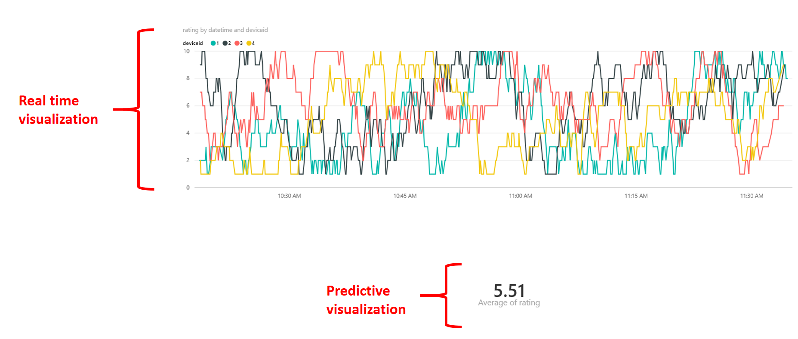
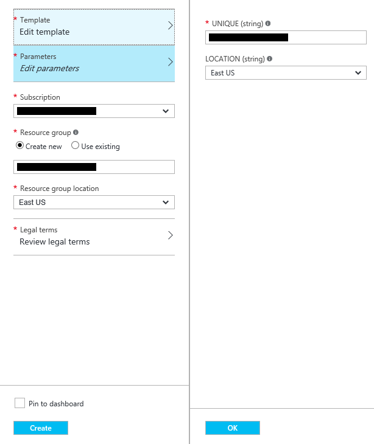
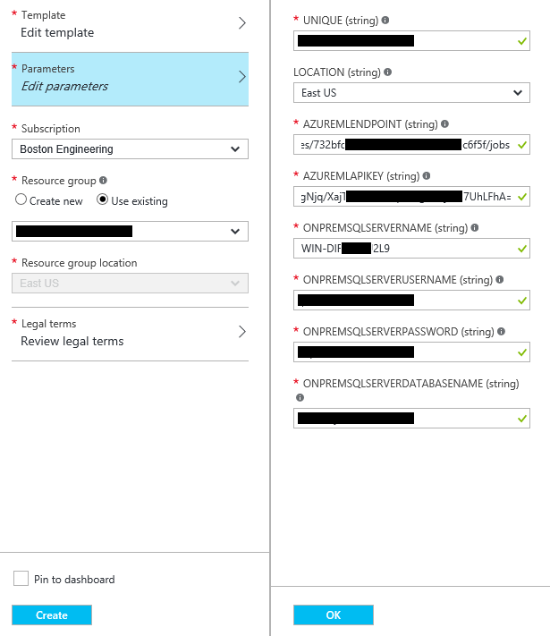
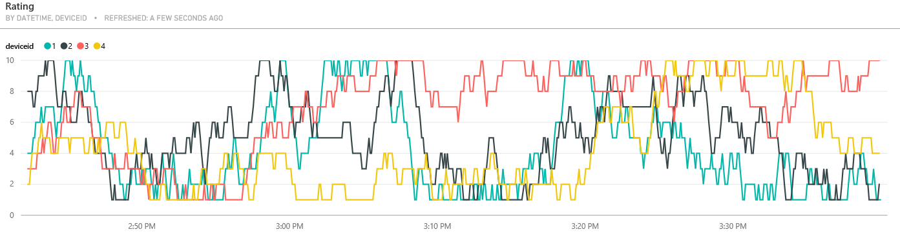
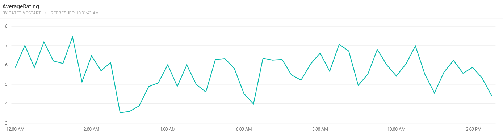

<properties
	pageTitle="ADF Data Movement from IaaS AWS SQLServer to Azure Blob and SQLServer | Microsoft Azure"
	description="Describes the steps needed to copy data from an IaaS AWS/EC2 SQLServer to Azure Blob and SQLServer."
	keywords="adf, azure data factory"
	services="datafactory"
	documentationCenter=""
	authors="roalexan"
	manager="paulettm"
	editor=""/>

<tags
	ms.service="datafactory"
	ms.workload="data-services"
	ms.tgt_pltfrm="na"
	ms.devlang="na"
	ms.topic="article"
	ms.date="02/23/2016"
	ms.author="roalexan" />

# Setting up predictive analytics pipelines using Azure SQL Data Warehouse

## Azure SQL Data Warehouse

 <a href="https://azure.microsoft.com/en-us/documentation/articles/sql-data-warehouse-overview-what-is"/>Azure SQL Data Warehouse</a> is a cloud-based, scalable database capable of processing massive volumes of data. It is ideally suited for storing structured data with a defined schema. Due to it's <a href="https://technet.microsoft.com/en-us/library/hh393582%28v=sql.110%29.aspx"/>MPP</a> architecture and use of Azure storage, it provides optimized query performance along with the ability to grow or shrink storage and compute independently. SQL Data Warehouse uses SQL Server's Transact-SQL (<a href="https://msdn.microsoft.com/en-us/library/mt243830.aspx"/>TSQL</a>) syntax for many operations and supports a broad set of traditional SQL constructs such as stored procedures, user-defined functions, table partitioning, indexes, and collations. It is integrated with traditional SQL Server and third party tools, along with many services in Azure such as <a href="https://azure.microsoft.com/en-us/services/data-factory/"/>Azure Data Factory</a>, <a href="https://azure.microsoft.com/en-us/services/stream-analytics/"/>Stream Analytics</a>, <a href="https://azure.microsoft.com/en-us/services/machine-learning/">Machine Learning</a>, and <a href="https://powerbi.microsoft.com/en-us/"/>Power BI</a>.

## Use Case

To demonstrate the power of Azure SQL Data Warehouse we will examine a sample use case that integrates SQL Data Warehouse with a number of Azure components, namely Event Hub, Stream Analytics, Machine Learning, and Power BI - as well as an on-prem SQL Server via a Data Management Gateway. At the end of this gallery we will include the steps to deploy this use case in your Azure subscription.

The use case is a rating system that allows users to rate an event (such as a conference talk) and visualize the results in real time (currently 5 second intervals). Ratings are also stored in a data warehouse and sent to machine learning for near real time predictions (currently 15 minute intervals). Lastly, historical ratings are bulk-loaded from an on-prem database.

When everything is successfully deployed and running, the final result will be a PowerBI dashboard showing the ratings of each individual device in real time and the average rating for all four devices.

Here is a screenshot of a sample dashboard.

## Requirements

- Microsoft Azure subscription with login credentials
- PowerBI subscription with login credentials
- A local environment with
    - SQL Server
    - Data Management Gateway
    - A SQL client (Example: Microsoft SQL Server Management Studio)

## Architecture

The architecture is illustrated below.

Real time ratings are generated via a data generator deployed as an <a href="https://azure.microsoft.com/en-us/documentation/articles/web-sites-create-web-jobs/">Azure Web Job</a>. New ratings are generated every 5 seconds for four simulated devices (and one event) and sent to an Event Hub. An Azure Stream Analytics job then sends the ratings to a) Power BI for real time visualization and b) SQL Data Warehouse for storage and predictive analytics

Predictive analytics is done by sending the ratings from SQL Data Warehouse to the batch endpoint of an experiment published as a web service in the Azure Machine Learning Studio, where the results are written back to SQL Data Warehouse. An Azure Data Factory orchestrates these operations. For now the experiment simply returns the average rating for the event, but you could consider doing more advanced analytics such as computing the average rating in Stream Analytics and doing predictions in AML based on location, event type, and device counts.

Bulk-loading is done by creating the schema in an on-prem SQL Server and populating the table with sample ratings data (downloadable from GitHub). A Data Management Gateway is used in the on-prem environment to connect the SQL Server to Azure SQL Data Warehouse. A Data Factory schedules the copying of the data from on-prem SQL Server to SQL Data Warehouse.

## Deploy

### Service Bus, Event Hub, Stream Analytics Job, SQL Server, and SQL Data Warehouse

Click this button

<a href="https://portal.azure.com/#create/Microsoft.Template/uri/https%3A%2F%2Fraw.githubusercontent.com%2Froalexan%2FSolutionArchitects%2Fmaster%2Fazuredeploypart1.json" target="_blank">
    
</a>

This will create a new "blade" in the Azure portal.

1. Parameters
   1. Type: UNIQUE (string): **[*UNIQUE*]** # Select a globally unique string
   1. Select: LOCATION: **[*LOCATION*]** # The region where everything will be deployed
   1. Click: **OK**
1. Select: Subscription: **[*SUBSCRIPTION*]** # Name of the Azure subscription you want to use
1. Resource group
   1. Select: **New**
   1. Type: New resource group name: **[*UNIQUE*]** # Same as above
1. Select: Resource group location: **[*LOCATION*]** # Same as above
1. Check: **Pin to dashboard** # If you want it on your dashboard
1. Click: **Create**

### Create Azure SQL Data Warehouse tables

1. Connect to the Data Warehouse using a SQL client of your choice. For example:
   1. Start: **Microsoft SQL Server Management Studio**
   1. Click: **File** > **Connect Object Explorer...**
   1. Select: Server type: **Database Engine**
   1. Type: Server name: **personal-[*UNIQUE*].database.windows.net**
   1. Select: Authentication: **SQL Server Authentication**
   1. Type: Login: **personaluser**
   1. Type: Password: **pass@word1**
   1. Check: **Remember password** # Optional
  1. Click: **Connect**
1. Create the tables. For example:
	 1. Expand: **personal-[*UNIQUE*].database.windows.net** > Databases > **personalDB**
	 1. Click: **New Query** # You may safely ignore the warning concerning QueryGovernorCostLimit if you see it
	 1. Copy and Paste:
            CREATE TABLE Ratings (
               DateTime DATETIME2,
               EventId INT,
               Rating INT,
               DeviceId INT,
               Lat DECIMAL(8,5),
               Lon DECIMAL(8,5)
            )
            WITH (
               DISTRIBUTION = HASH(DateTime),
               CLUSTERED COLUMNSTORE INDEX
		    )
            CREATE TABLE AverageRatings (
	           EventId INT,
	           AverageRating FLOAT
            )
            WITH (
	           CLUSTERED COLUMNSTORE INDEX
            )
     1. Click: **Execute**

### Create the AML service

1. Browse: http://gallery.azureml.net/Details/359adba3520749f8bd78ce3fbdf4437a
1. Click: Open in Studio
1. Select: REGION: **[*REGION*]** # Up to you
1. Select: WORKSPACE: **[*WORKSPACE*]** # Your workspace
1. Click: OK
1. Click: Reader
1. Type: Server user account password: **pass@word1**
1. Click: Writer
1. Type: Server user account password: **pass@word1**
1. Click: RUN
1. Click: DEPLOY WEB SERVICE
1. Click: TEST # Verify that request/response works
1. Click: DATABASE QUERY:
      SELECT
      CAST(Rating AS INT) AS Rating
      FROM Ratings
      WHERE EventId = 1
1. Click: DATABASE SERVER NAME: **personal-[*UNIQUE*].database.windows.net**
1. Click: DATABASE NAME: personalDB
1. Click: SERVER USER ACCOUNT NAME: personaluser
1. Click: SERVER USER ACCOUNT PASSWORD: pass@word1
1. Click: OK

### Edit and start the ASA job

1. Browse: https://manage.windowsazure.com
1. Click: **personalstreamanalytics<unique>**
1. Click: **OUTPUTS**
1. Click: **ADD OUTPUT**
1. Select: **Power BI**
1. Click: **Next**
1. Click: **Authorize Now** # Login with your credentials
1. Type: OUTPUT ALIAS: **OutputPowerBI**
1. Type: DATASET NAME: **personalDB** # This dataset will be overwritten in PBI should it already exist
1. Type: TABLE NAME: **personalDB**
1. Select: WORKSPACE: **My Workspace** # Default
1. Click: **Finish**
1. Click: **Start**
1. Click: **Finish** # You do not need to specify a custom time

### Download and run the data generator

1. Download **debug.zip**
1. Unzip
1. Edit: **Rage.exe.config**
1. Replace: EVENTHUBNAME: With: **personaleventhub[*UNIQUE*]**
1. Browse: https://manage.windowsazure.com # Get the endpoint
1. Click: SERVICE BUS
1. Click: CONNECTION INFORMATION
1. Copy: CONNECTION STRING
1. Replace: ENDPOINT: With: CONNECTION STRING
1. Double click: **Rage.exe** # Runs until you click any key on the console

## Create the Data factories

At this point you are ready to connect everything together. You will create two data factories. The first data factory will orchestrate data to be read from the SQL Data Warehouse by Azure Machine Learning, at which point the average rating is computed and written back to the SQL Data Warehouse. The second data factory will orchestrate copying data from the on prem SQL Server to the SQL Data Warehouse.

Click this button

<a href="https://portal.azure.com/#create/Microsoft.Template/uri/https%3A%2F%2Fraw.githubusercontent.com%2Froalexan%2FSolutionArchitects%2Fmaster%2Fazuredeploypart2.json" target="_blank">
    
</a>

This will create a new "blade" in the Azure portal.

1. Parameters
   1. Type: UNIQUE (string): **[*UNIQUE*]** # Use the one previously entered
   1. Select: LOCATION: **[*LOCATION*]** # Use the one previously selected
   1. Click: **OK**
1. Select: Subscription: **[*SUBSCRIPTION*]** # Use the one previously selected
1. Select: Resource group: **[*UNIQUE*]** # Use the one previously selected
1. Check: **Pin to dashboard** # If you want it on your dashboard
1. Click: **Create**

**TODO** Must also pass in AML endpoint and API key!

### Create the PBI dashboard

#### Realtime visualization

1. Browse: https://powerbi.microsoft.com
1. Click: **Sign in** # Login with your credentials
1. Show: The navigation pane
1. Click: **personalDB** # Under the Datasets folder
1. Click: **Line chart** # Under Visualizations
1. Drag: **datetime**: To: **Axis**
1. Drag: **deviceid**: To: **Legend**
1. Drag: **rating**: To: **Values**
1. Click: **Save**
1. Type: Name: **personalDB**
1. Click: **Save**
1. Click: **Pin visual** # pin icon on upper-right
1. Select: **New dashboard**
1. Type: Name: **personalDB**
1. Click: **Pin**

#### Predictive visualization

1. Browse: https://powerbi.microsoft.com
1. Click: **Sign in** # Login with your credentials
1. Show: The navigation pane
1. Click: Get Data
1. Click: Databases: Get
1. Click: Azure SQL Data Warehouse
1. Click: Connect
1. Click: Server:**personal-[*UNIQUE*].database.windows.net**
1. Click: Database: personalDB
1. Click: Next
1. Click: Username: **personaluser**
1. Click: Password: **pass@word1**
1. Click: Sign in
1. Click: Datasets: personalDB
1. Click: Visualizations: Card
1. Expand: Fields: AverageRatings
1. Check: AverageRating
1. Click: Save
1. Type: Name: personalDB2
1. Click: Save
1. Click: Reports: personalDB2
1. Click: Pin icon
1. Select: Existing dashboard
1. Select: personalDB
1. Click: Pin
1. Select: Dashboards: personalDB
1. Resize tiles

## Summary

Congratulations! If you made it to this point, you should have a running sample with real time and predictive pipelines showcasing the power of Azure SQL Data Warehouse and its integration with many of the other Azure services. The final section lists the steps to tear things down when you are done.

## Undeploy
1. Browse: https://portal.azure.com
1. Expand: Resource groups
1. Select: your resource group
1. Click: ...
1. Select: Delete

## Debugging

### Verify data being written

##### From Portal

1. Browse: https://manage.windowsazure.com
1. Click: **personalstreamanalytics[*UNIQUE*]**
1. Click: DASHBOARD
1. Click: **Operation Logs**
1. Select: a recent log
1. Click: DETAILS

##### From SQL Client

1. Connect to the Data Warehouse using a SQL client of your choice
1. Run SQL to view the latest entries. For example:
   1. Expand: **personal-[*UNIQUE*].database.windows.net** > Databases > **personalDB**
   1. Click: **New Query** # You may safely ignore the warning concerning QueryGovernorCostLimit if you see it
   1. Copy and Paste:
	      select * from Ratings order by DateTime desc;
   1. Click: **Execute**
